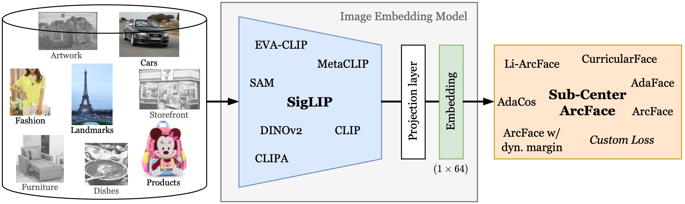

# MDFE - Multi-Domain Feature Extraction



Intro text (e.g. abstract)

## Table of Contents


## I. Setup
Here, we describe a step-by-step guide to setup and install dependencies on a UNIX-based system, such as Ubuntu, using 
`conda` as package manager. If `conda` is not available, alternative package managers such as `venv` can be used.

#### 1. Create a virtual environment
```
conda create -n env_mdfe python=3.8
conda activate env_mdfe
```
#### 2. Clone the repository
```
git clone git@github.com:morrisfl/mdfe.git
```
#### 3. Install pytorch
Depending on your system and compute requirements, you may need to change the command below. See [pytorch.org](https://pytorch.org/get-started/locally/) 
for more details. In order to submit the embedding models to the 2022 [Google Universal Image Embedding Challenge](https://www.kaggle.com/competitions/google-universal-image-embedding), 
PyTorch 1.11.0 is required.
```
conda install pytorch==1.11.0 torchvision==0.12.0 cudatoolkit=11.3 -c pytorch
```
#### 4. Install the repository with all dependencies
```
cd mdfe
python -m pip install .
```
If you want to make changes to the code, you can install the repository in editable mode:
```
python -m pip install -e .
```
#### 5. Setup Google Drive access (optional)
In order to automatically upload checkpoints to Google Drive, you need to create a Google Drive API key. 
Setup instructions can be found [here](src/utils/google_drive.md).

## II. Data Preparation
In the process of fine-tuning/linear probing the embedding models, the following dataset options are available:

#### 1. *M4D-35k* dataset

#### 2. Select other datasets


## III. Training